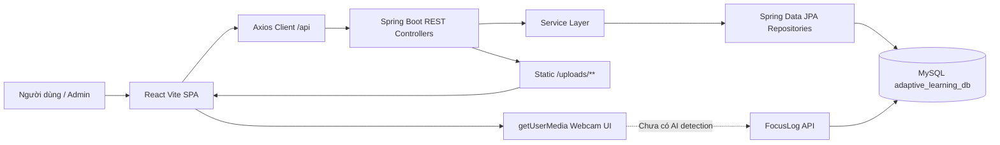
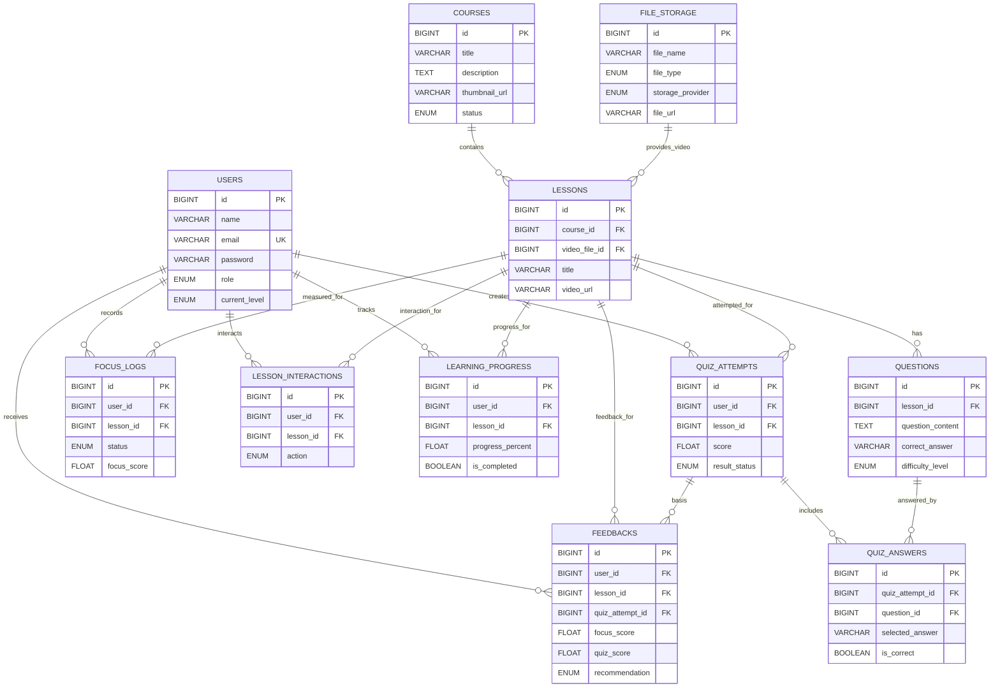

# PROJECT AUDIT - Adaptive Learning System

Ngày audit: 2026-06-09  
Vai trò audit: Technical Lead  
Phạm vi: toàn bộ repository `D:\DATN`

## Executive Summary

Dự án là hệ thống học tập trực tuyến thích ứng, gồm backend Spring Boot REST API, frontend React/Vite và database MySQL. Phần CRUD học liệu, quiz, feedback, dashboard, upload local, progress và interaction đã có nền tảng tương đối đầy đủ. Phần Face-A/AI webcam mới dừng ở mức bật/tắt webcam và backend lưu focus logs, chưa có `face-api.js`, TensorFlow.js, model AI, detection loop hoặc gửi focus log tự động.

Kết quả kiểm tra build/test tại thời điểm audit:

- Frontend `npm run lint`: PASS.
- Frontend `npm run build`: PASS.
- Backend `mvn test`: PASS, 6 tests, 0 failures.

Ước lượng tiến độ tổng thể: **72%**.

---

# PHẦN 1 - CẤU TRÚC DỰ ÁN

## Cây thư mục rút gọn

```text
D:\DATN
├── backend
│   ├── src/main/java/com/datn/backend
│   │   ├── config
│   │   │   └── CorsConfig.java
│   │   ├── controller
│   │   │   ├── AuthController.java
│   │   │   ├── CourseController.java
│   │   │   ├── DashboardController.java
│   │   │   ├── FeedbackController.java
│   │   │   ├── FileStorageController.java
│   │   │   ├── FocusLogController.java
│   │   │   ├── LearningProgressController.java
│   │   │   ├── LessonController.java
│   │   │   ├── LessonInteractionController.java
│   │   │   ├── QuestionController.java
│   │   │   ├── QuizController.java
│   │   │   └── UserController.java
│   │   ├── dto
│   │   ├── entity
│   │   ├── repository
│   │   ├── service
│   │   └── BackendApplication.java
│   ├── src/main/resources
│   │   └── application.properties
│   ├── src/test/java/com/datn/backend
│   │   ├── BackendApplicationTests.java
│   │   ├── dto/FocusLogRequestValidationTest.java
│   │   └── service/FocusLogServiceTest.java
│   ├── uploads
│   │   ├── images
│   │   └── videos
│   └── pom.xml
├── frontend
│   ├── public
│   ├── src
│   │   ├── api
│   │   ├── assets
│   │   ├── components
│   │   ├── pages
│   │   ├── routes
│   │   ├── utils
│   │   ├── App.css
│   │   ├── App.jsx
│   │   └── main.jsx
│   ├── package.json
│   └── vite.config.js
├── database.sql
├── sample_data.sql
└── PROJECT_REQUIREMENTS.md
```

## Vai trò từng phần

| Phần | Vai trò |
|---|---|
| `backend` | REST API, business logic, JPA entity, repository, upload local, CORS/static file. |
| `frontend` | React SPA cho student/admin, routing, gọi API bằng Axios, UI dashboard/course/lesson/quiz/admin. |
| `database.sql` | Schema MySQL chính của hệ thống. Không có thư mục migrations riêng. |
| `sample_data.sql` | Dữ liệu mẫu cho users, courses, files, lessons, questions. |
| `frontend/src/api` | API client wrappers cho từng module. |
| `frontend/src/assets`, `frontend/public`, `backend/uploads` | Asset UI và file upload local. |
| `backend/src/main/java/.../config` | CORS và static resource mapping `/uploads/**`. |
| `backend/src/main/java/.../entity` | Models/JPA entities map bảng database. |
| `backend/src/main/java/.../controller` | REST controllers. |
| `backend/src/main/java/.../service` | Business logic. |
| `middleware` | Chưa có middleware/security filter riêng. Chỉ có CORS config. |

---

# PHẦN 2 - KIẾN TRÚC HỆ THỐNG

## Stack hiện tại

| Hạng mục | Công nghệ |
|---|---|
| Backend framework | Spring Boot 3.3.6 |
| Backend language | Java 17 |
| Data access | Spring Data JPA, Hibernate |
| Database | MySQL |
| Frontend framework | React 19 + Vite |
| Frontend language | JavaScript/JSX |
| Routing | react-router-dom |
| HTTP client | Axios |
| Validation | Jakarta Bean Validation |
| Auth hiện tại | Custom login/register, plain text password, không Spring Security/JWT |
| API structure | REST JSON, prefix `/api/...` |

## Kiến trúc

Backend đang theo **layer-based package**:

```text
controller -> service -> repository -> entity -> database
dto        -> dùng cho request/response
config     -> CORS/static file
```

Frontend là SPA:

```text
routes -> pages -> api client -> backend REST API
components -> UI tái sử dụng
utils -> helper xử lý dữ liệu
```

## Sơ đồ luồng hệ thống



---

# PHẦN 3 - DATABASE AUDIT

## Migrations/schema/sql files

| File | Vai trò | Ghi chú |
|---|---|---|
| `database.sql` | Schema chính | Có 11 bảng, FK đầy đủ. |
| `sample_data.sql` | Seed data mẫu | Có users/courses/file_storage/lessons/questions. Một số URL mẫu dùng `/files/...` không khớp upload local mới `/uploads/...`. |
| migrations folder | Không có | Nên bổ sung Flyway/Liquibase nếu dự án cần quản lý version schema. |

## Danh sách bảng

| Bảng | Mục đích | PK | FK / Quan hệ |
|---|---|---|---|
| `users` | Tài khoản student/admin, level hiện tại | `id` | 1-N `quiz_attempts`, `focus_logs`, `feedbacks`, `lesson_interactions`, `learning_progress` |
| `courses` | Khóa học | `id` | 1-N `lessons` |
| `file_storage` | Metadata file local/drive | `id` | 1-N `lessons.video_file_id` |
| `lessons` | Bài học thuộc course, video | `id` | N-1 `courses`, N-1 `file_storage`; 1-N `questions`, `quiz_attempts`, `focus_logs`, `feedbacks`, `lesson_interactions`, `learning_progress` |
| `questions` | Câu hỏi quiz theo lesson | `id` | N-1 `lessons` |
| `quiz_attempts` | Lượt làm quiz | `id` | N-1 `users`, N-1 `lessons`; 1-N `quiz_answers`; 1-N `feedbacks` |
| `quiz_answers` | Câu trả lời trong attempt | `id` | N-1 `quiz_attempts`, N-1 `questions` |
| `focus_logs` | Log tập trung theo user/lesson | `id` | N-1 `users`, N-1 `lessons` |
| `feedbacks` | Phản hồi học tập sau quiz | `id` | N-1 `users`, N-1 `lessons`, N-1 nullable `quiz_attempts` |
| `lesson_interactions` | View/like/dislike bài học | `id` | N-1 `users`, N-1 `lessons` |
| `learning_progress` | Tiến trình học theo user/lesson | `id` | N-1 `users`, N-1 `lessons` |

## ERD Mermaid



---

# PHẦN 4 - CHỨC NĂNG ĐÃ HOÀN THÀNH

| Chức năng | Trạng thái | File backend/API | File frontend/UI | Ghi chú |
|---|---:|---|---|---|
| Đăng ký | 90% | `AuthController`, `AuthService`, `RegisterRequest`, `UserResponse`, `POST /api/auth/register` | `Register.jsx` | Chạy được, plain password, chưa có token. |
| Đăng nhập | 85% | `POST /api/auth/login` | `Login.jsx`, `Navbar.jsx` | Login trả user, frontend lưu localStorage. Không có Spring Security/JWT. |
| Profile | 65% | `GET /api/users/{id}` | `ProfilePage.jsx`, `userApi.js` | Frontend ưu tiên `/users/me` nhưng backend chưa có, fallback `/users/{id}`. |
| Course CRUD | 90% | `CourseController`, `CourseService`, `CourseRepository` | `AdminCoursesPage.jsx`, `CoursesPage.jsx`, `CourseDetailPage.jsx` | Có GET/POST/PUT/DELETE và trending. |
| Lesson CRUD | 90% | `LessonController`, `LessonService`, `LessonRepository` | `AdminLessonsPage.jsx`, `AdminCourseContentPage.jsx`, `LessonDetailPage.jsx` | Có upload video local qua File API. |
| Question CRUD | 90% | `QuestionController`, `QuestionService`, `QuestionRepository` | `AdminQuestionsPage.jsx`, `AdminLessonQuestionsPage.jsx` | Có validate answer/difficulty. |
| File upload local | 85% | `FileStorageController`, `FileStorageService`, `CorsConfig` | `AdminFilesPage.jsx`, admin course/lesson pages | Lưu `uploads/images/videos/documents`, static `/uploads/**`. Delete chỉ xóa metadata, chưa xóa file vật lý. |
| Quiz start/submit | 85% | `QuizController`, `QuizService`, quiz repositories | `QuizPage.jsx` | Tính score/pass/fail, lưu answers, chống submit trùng attempt. |
| Adaptive learning | 75% | `LearningProgressService`, `LearningProgressController` | `LessonDetailPage.jsx`, `StudentDashboardPage.jsx`, `CourseProgressDetailPage.jsx` | Update current_level và progress sau quiz/complete. Chưa chọn câu hỏi theo level. |
| Learning progress UI/API | 85% | `/api/progress/start`, `/complete`, `/user/{id}` | Dashboard, Lesson Detail, Course Progress Detail | Hoạt động theo user/lesson. |
| Feedback generate | 80% | `FeedbackController`, `FeedbackService` | `QuizPage.jsx`, `FeedbackPage.jsx`, `StudentDashboardPage.jsx` | Tự generate sau submit quiz. Không có focus logs thì focusScore = 0. |
| Focus logs backend | 75% | `FocusLogController`, `FocusLogService`, tests | Chưa gửi tự động từ UI | API và validation đã có, chưa tích hợp AI/webcam gửi log. |
| Lesson interactions | 85% | `LessonInteractionController`, `LessonInteractionService` | `LessonDetailPage.jsx` | View/like/dislike, reaction 1 user/lesson đã xử lý. |
| Student dashboard | 80% | `DashboardController`, `LearningProgress`, `Feedback`, `Quiz` APIs | `StudentDashboardPage.jsx` | Có overview, progress theo course, quiz history, feedback. |
| Admin dashboard | 80% | `DashboardService` | `AdminDashboardPage.jsx` | Có summary cards. Chưa có role guard thật. |
| Trending courses | 85% | `GET /api/courses/trending` | `CoursesPage.jsx`, `Home.jsx`, `TrendingCourseCard.jsx` | Tính runtime từ interactions. |
| CORS/static file | 90% | `CorsConfig` | N/A | Cho `http://localhost:5173` và `/uploads/**`. |

---

# PHẦN 5 - FACE-A INTEGRATION AUDIT

## Kết quả tìm kiếm code

| Từ khóa | Tình trạng |
|---|---|
| `face-api.js`, `faceapi`, `tensorflow`, `tfjs` | Chỉ có trong `PROJECT_REQUIREMENTS.md`, chưa có dependency/code. |
| `webcam`, `camera`, `getUserMedia` | Có trong `LessonDetailPage.jsx` và CSS. |
| `focus tracking`, `attention tracking`, `emotion detection`, `face recognition` | Chưa có detection thật. |
| `focus_logs` API | Có backend API, DTO validation, service test. |

## Mức độ hoàn thành Face-A

| Hạng mục | Trạng thái | Hoàn thành |
|---|---|---:|
| UI webcam trong Lesson Detail | Có | 70% |
| Bật/tắt camera bằng `getUserMedia` | Có | 80% |
| Tắt stream khi unmount | Có | 80% |
| face-api.js dependency | Chưa có | 0% |
| Tải model AI | Chưa có | 0% |
| Realtime face detection | Chưa có | 0% |
| Phân loại `focused/distracted/no_face` | Chưa có | 0% |
| Tính focusScore realtime | Chưa có | 0% |
| Gửi focus logs tự động | Chưa có | 0% |
| Backend nhận/lưu focus logs | Có | 85% |

Tổng mức hoàn thành Face-A: **25%**.

Blocker chính:

- Chưa cài `face-api.js` / TensorFlow.js.
- Chưa có thư mục model weights.
- Chưa có thuật toán xác định focused/distracted/no_face.
- Chưa có batching/throttling gửi `/api/focus-logs`.
- Chưa có kiểm thử browser cho camera/detection.

---

# PHẦN 6 - API AUDIT

## Routes backend

| API | Controller | Request | Response | Trạng thái |
|---|---|---|---|---|
| `POST /api/auth/register` | `AuthController` | `RegisterRequest` | `UserResponse` | ✅ |
| `POST /api/auth/login` | `AuthController` | `LoginRequest` | `UserResponse` | ✅ |
| `GET /api/users/{id}` | `UserController` | path id | `UserResponse` | ✅ |
| `GET /api/users/me` | Không có | token/session | `UserResponse` | ❌ |
| `GET /api/courses` | `CourseController` | none | `List<CourseResponse>` | ✅ |
| `GET /api/courses/trending` | `CourseController` | none | `List<CourseTrendingResponse>` | ✅ |
| `GET /api/courses/{id}` | `CourseController` | path id | `CourseResponse` | ✅ |
| `POST /api/courses` | `CourseController` | `CourseRequest` | `CourseResponse` | ✅ |
| `PUT /api/courses/{id}` | `CourseController` | `CourseRequest` | `CourseResponse` | ✅ |
| `DELETE /api/courses/{id}` | `CourseController` | path id | void | ✅ |
| `GET /api/lessons` | `LessonController` | none | `List<LessonResponse>` | ✅ |
| `GET /api/lessons/{id}` | `LessonController` | path id | `LessonResponse` | ✅ |
| `POST /api/lessons` | `LessonController` | `LessonRequest` | `LessonResponse` | ✅ |
| `PUT /api/lessons/{id}` | `LessonController` | `LessonRequest` | `LessonResponse` | ✅ |
| `DELETE /api/lessons/{id}` | `LessonController` | path id | void | ✅ |
| `GET /api/questions` | `QuestionController` | none | `List<QuestionResponse>` | ✅ |
| `GET /api/questions/{id}` | `QuestionController` | path id | `QuestionResponse` | ✅ |
| `GET /api/questions/lesson/{lessonId}` | `QuestionController` | path lessonId | `List<QuestionResponse>` | ✅ |
| `POST /api/questions` | `QuestionController` | `QuestionRequest` | `QuestionResponse` | ✅ |
| `PUT /api/questions/{id}` | `QuestionController` | `QuestionRequest` | `QuestionResponse` | ✅ |
| `DELETE /api/questions/{id}` | `QuestionController` | path id | void | ✅ |
| `POST /api/quiz/start` | `QuizController` | `StartQuizRequest` | `QuizAttemptResponse` | ✅ |
| `POST /api/quiz/submit` | `QuizController` | `SubmitQuizRequest` | `QuizAttemptResponse` | ✅ |
| `GET /api/quiz/attempts/{id}` | `QuizController` | path id | `QuizAttemptResponse` | ✅ |
| `GET /api/quiz/user/{userId}` | `QuizController` | path userId | `List<QuizAttemptResponse>` | ✅ |
| `GET /api/quiz/lesson/{lessonId}` | `QuizController` | path lessonId | `List<QuizAttemptResponse>` | ✅ |
| `POST /api/progress/start` | `LearningProgressController` | `LearningProgressStartRequest` | `LearningProgressResponse` | ✅ |
| `PUT /api/progress/complete` | `LearningProgressController` | `LearningProgressStartRequest` | `LearningProgressResponse` | ✅ |
| `GET /api/progress/user/{userId}` | `LearningProgressController` | path userId | `List<LearningProgressResponse>` | ✅ |
| `GET /api/progress/user/{userId}/course/{courseId}` | `LearningProgressController` | path ids | `List<LearningProgressResponse>` | ✅ |
| `POST /api/focus-logs` | `FocusLogController` | `FocusLogRequest` | `FocusLogResponse` | ✅ |
| `GET /api/focus-logs/user/{userId}` | `FocusLogController` | path userId | `List<FocusLogResponse>` | ✅ |
| `GET /api/focus-logs/lesson/{lessonId}` | `FocusLogController` | path lessonId | `List<FocusLogResponse>` | ✅ |
| `GET /api/focus-logs/user/{userId}/lesson/{lessonId}` | `FocusLogController` | path ids | `List<FocusLogResponse>` | ✅ |
| `GET /api/focus-logs/attempt/{attemptId}` | `FocusLogController` | path attemptId | computed `FeedbackResponse` | ⚠️ |
| `POST /api/feedbacks/generate` | `FeedbackController` | `FeedbackRequest` | `FeedbackResponse` | ✅ |
| `GET /api/feedbacks/user/{userId}` | `FeedbackController` | path userId | `List<FeedbackResponse>` | ✅ |
| `GET /api/feedbacks/lesson/{lessonId}` | `FeedbackController` | path lessonId | `List<FeedbackResponse>` | ✅ |
| `GET /api/feedbacks/user/{userId}/lesson/{lessonId}` | `FeedbackController` | path ids | `List<FeedbackResponse>` | ✅ |
| `POST /api/lesson-interactions` | `LessonInteractionController` | `LessonInteractionRequest` | `LessonInteractionResponse` | ✅ |
| `GET /api/lesson-interactions/user/{userId}` | `LessonInteractionController` | path userId | `List<LessonInteractionResponse>` | ✅ |
| `GET /api/lesson-interactions/user/{userId}/lesson/{lessonId}/reaction` | `LessonInteractionController` | path ids | `LessonInteractionReactionResponse` | ✅ |
| `GET /api/lesson-interactions/lesson/{lessonId}` | `LessonInteractionController` | path lessonId | `List<LessonInteractionResponse>` | ✅ |
| `GET /api/lesson-interactions/lesson/{lessonId}/stats` | `LessonInteractionController` | path lessonId | `LessonInteractionStatsResponse` | ✅ |
| `POST /api/files` | `FileStorageController` | `FileStorageRequest` | `FileStorageResponse` | ⚠️ |
| `POST /api/files/upload` | `FileStorageController` | multipart `file`, `fileType` | `FileStorageResponse` | ✅ |
| `GET /api/files` | `FileStorageController` | none | `List<FileStorageResponse>` | ✅ |
| `GET /api/files/{id}` | `FileStorageController` | path id | `FileStorageResponse` | ✅ |
| `DELETE /api/files/{id}` | `FileStorageController` | path id | void | ⚠️ |
| `GET /api/admin/dashboard/summary` | `DashboardController` | none | `DashboardSummaryResponse` | ✅ |
| `GET /api/admin/dashboard/users/{userId}` | `DashboardController` | path userId | `UserDashboardResponse` | ✅ |
| `GET /api/admin/dashboard/lessons/{lessonId}` | `DashboardController` | path lessonId | `LessonDashboardResponse` | ✅ |
| `GET /api/dashboard/summary` | `DashboardController` | none | `DashboardSummaryResponse` | ✅ |
| `GET /api/dashboard/users/{userId}` | `DashboardController` | path userId | `UserDashboardResponse` | ✅ |
| `GET /api/dashboard/lessons/{lessonId}` | `DashboardController` | path lessonId | `LessonDashboardResponse` | ✅ |

Ghi chú:

- `GET /api/focus-logs/attempt/{attemptId}` trả feedback tính toán nhưng không lưu DB; tên route chưa đúng domain.
- `POST /api/files` vẫn cho metadata thủ công/Google Drive dù frontend đã bỏ Google Drive.
- `DELETE /api/files/{id}` xóa metadata, chưa xóa file vật lý trong `uploads`.
- Không có global exception handler format lỗi thống nhất.

---

# PHẦN 7 - UI AUDIT

| Trang | Trạng thái | Ghi chú |
|---|---|---|
| `/` Home | ✅ | Hero, stats, continue learning, trending courses. |
| `/login` | ✅ | Form login controlled, lưu user localStorage. |
| `/register` | ✅ | Form register controlled, tự login sau register. |
| `/profile` | ⚠️ | Gọi `/users/me` trước nhưng backend chưa có; fallback `/users/{id}`. |
| `/courses` | ✅ | Search/filter, all courses, trending, cards responsive. |
| `/courses/:id` | ✅ | Course hero, learning path, progress status. |
| `/lessons/:id` | ✅ | Video player/placeholder, webcam UI, progress, quiz, interactions, next lesson. |
| `/quiz/:lessonId` | ✅ | Start quiz, questions, submit, result, generate feedback. |
| `/feedback/:attemptId` | ✅ | Hiển thị feedback theo attempt/user. |
| `/dashboard` | ✅ | Student dashboard, progress theo course, quiz history, feedback, suggestions. |
| `/dashboard/courses/:courseId/progress` | ✅ | Chi tiết tiến trình khóa học. |
| `/admin/dashboard` | ✅ | Dashboard cards theo nhóm. |
| `/admin/courses` | ✅ | CRUD course, upload thumbnail image. |
| `/admin/courses/:courseId/content` | ✅ | Quản lý nội dung course, thêm/sửa/xóa lesson, upload video. |
| `/admin/lessons` | ✅ | CRUD lessons, upload video. |
| `/admin/lessons/:lessonId/questions` | ✅ | CRUD questions theo lesson. |
| `/admin/questions` | ✅ | CRUD tất cả questions. |
| `/admin/files` | ✅ | Upload local file, list, xem/copy/delete metadata. |

## Components

| Component | Trạng thái | Ghi chú |
|---|---|---|
| `AppLayout` | ✅ | Layout chung + Navbar + Outlet. |
| `Navbar` | ⚠️ | Hiển thị theo role từ localStorage, chưa có route guard/security thật. |
| `CourseCard` | ✅ | Dùng ở course list. |
| `TrendingCourseCard` | ✅ | Dùng cho trending. |

---

# PHẦN 8 - TECHNICAL DEBT

## HIGH

1. **Authentication chưa an toàn**
   - Password plain text.
   - Không JWT/session/Spring Security.
   - Admin role chỉ dựa trên localStorage ở frontend.
   - API admin không được bảo vệ.

2. **Face-A chưa được tích hợp thật**
   - Chưa có dependency/model/detection loop.
   - Không có gửi focus logs tự động từ webcam.
   - Focus score hiện chỉ đến từ API thủ công hoặc rỗng.

3. **Không có global exception handler**
   - Lỗi `ResponseStatusException`/validation có format mặc định, frontend khó hiển thị nhất quán.

4. **Không có unique constraint cho progress/reaction**
   - Code cleanup duplicate ở service, nhưng DB vẫn cho trùng `learning_progress(user_id, lesson_id)` và `lesson_interactions(user_id, lesson_id, like/dislike)`.
   - Vì yêu cầu hiện tại không đổi schema nên chưa sửa, nhưng đây là debt về data integrity.

## MEDIUM

1. **Adaptive quiz chưa thật sự chọn câu theo current_level**
   - Backend validate difficulty và update `users.current_level`, nhưng frontend lấy tất cả questions theo lesson.

2. **File delete chỉ xóa metadata**
   - File vật lý trong `backend/uploads` không bị xóa.

3. **`GET /api/users/me` chưa có**
   - Frontend đã chuẩn bị fallback nhưng API ưu tiên bị 404.

4. **Route `GET /api/focus-logs/attempt/{attemptId}` sai domain**
   - Thực chất trả feedback tính toán, nên nên chuyển sang `/api/feedbacks/attempt/{attemptId}` hoặc dùng feedback DB.

5. **Sample data URL cũ**
   - `sample_data.sql` dùng `http://localhost:8080/files/...`, trong khi upload local mới là `/uploads/...`.

6. **Controller/API chưa có pagination/filter**
   - List users/courses/lessons/questions/files trả toàn bộ dữ liệu.

7. **Text mojibake trong terminal output**
   - File có vẻ UTF-8 nhưng môi trường PowerShell hiển thị sai encoding. Cần thống nhất UTF-8 khi demo/log.

## LOW

1. **Một số DTO vẫn giữ Google Drive fields**
   - DB có `drive_file_id`, frontend đã bỏ Google Drive, nhưng API metadata vẫn còn.

2. **CSS global rất lớn**
   - `App.css` chứa nhiều lớp theo từng giai đoạn, dễ xung đột override.

3. **Thiếu docs chạy project chi tiết**
   - Có `README.md` frontend mặc định, chưa có hướng dẫn full stack chuẩn.

4. **Thiếu kiểm thử frontend**
   - Chỉ có ESLint/build, chưa có unit/e2e test.

---

# PHẦN 9 - PROJECT PROGRESS

| Mảng | Tiến độ | Lý do |
|---|---:|---|
| Database | 95% | Schema đầy đủ cho modules chính; thiếu migrations/versioning và unique constraints nâng cao. |
| Backend | 85% | CRUD/API/service tốt; thiếu security, exception handler, Face-A integration, pagination. |
| Frontend | 82% | UI/pages đầy đủ, flow student/admin tốt; thiếu route guard thật, Face-A detection. |
| API | 86% | Hầu hết routes đầy đủ; một số route lệch domain hoặc còn metadata legacy. |
| Face-A | 25% | Mới có webcam UI + focus log backend, chưa có AI. |
| Testing | 30% | Backend có 6 tests, frontend chưa có tests, thiếu integration/e2e. |
| Documentation | 45% | Có requirements và SQL; thiếu README triển khai, API docs, demo script. |

**Tổng tiến độ dự án: 72%**

Nhận định:

- Nếu demo không yêu cầu AI thật: dự án đạt khoảng 80-85%.
- Nếu bắt buộc Face-A realtime đúng đề tài: dự án đạt khoảng 70-72%, vì AI là phần còn thiếu lớn nhất.

---

# PHẦN 10 - NEXT ROADMAP

## Giai đoạn 1 - Ổn định demo core LMS (2-3 ngày)

Mục tiêu: đảm bảo flow học tập/admin chạy mượt trước khi gắn AI.

Việc cần làm:

1. Thêm global exception handler cho backend.
2. Thêm `GET /api/users/me` hoặc sửa frontend bỏ ưu tiên route này.
3. Đồng bộ `sample_data.sql` sang URL `/uploads/...` hoặc seed bằng file metadata thực tế.
4. Thêm route guard frontend cơ bản:
   - chưa login -> redirect `/login`
   - không phải admin -> chặn `/admin/*`
5. Bổ sung README chạy full stack:
   - tạo database
   - import `database.sql`
   - import `sample_data.sql`
   - chạy backend
   - chạy frontend

Blocker: không có blocker lớn.

## Giai đoạn 2 - Hoàn thiện Adaptive Quiz thật (2-4 ngày)

Mục tiêu: quiz đúng tính "adaptive".

Việc cần làm:

1. Backend API lấy questions theo level:
   - lấy `user.current_level`
   - ưu tiên câu hỏi cùng difficulty
   - fallback nếu không đủ câu.
2. Frontend QuizPage gọi API adaptive thay vì lấy toàn bộ lesson questions.
3. Thêm config số câu hỏi/lần quiz.
4. Test unit cho:
   - score >= 80 tăng level
   - score < 50 giảm level
   - 50-79 giữ level
   - pass/fail/progress.

Blocker: cần thống nhất rule chọn câu hỏi adaptive.

## Giai đoạn 3 - Tích hợp Face-A realtime (5-8 ngày)

Mục tiêu: hoàn thiện trọng tâm đề tài.

Việc đã xong:

- UI webcam trong Lesson Detail.
- Bật/tắt camera bằng `getUserMedia`.
- Backend `POST /api/focus-logs` có validation `focused|distracted|no_face`, score 0-100.
- Dashboard/feedback đã dùng focus score nếu có log.

Việc phải làm tiếp:

1. Cài dependency:
   - `face-api.js`
   - nếu cần: `@tensorflow/tfjs`
2. Thêm model files vào `frontend/public/models`.
3. Tạo module `focusDetection`:
   - load model một lần
   - detect face định kỳ
   - trạng thái `no_face` khi không thấy mặt
   - trạng thái `focused/distracted` dựa trên heuristic đơn giản.
4. Tính focus score:
   - focused = 90-100
   - distracted = 40-60
   - no_face = 0-20
   - rolling average theo phiên học.
5. Gửi focus log theo interval 10-15 giây:
   - `POST /api/focus-logs`
   - không gửi ảnh/video.
6. Thêm UI indicator:
   - trạng thái hiện tại
   - điểm tập trung phiên học
   - lần đồng bộ gần nhất.
7. Test thủ công:
   - có mặt
   - quay mặt
   - rời khỏi camera
   - tắt quyền camera.

Blocker:

- Cần model `face-api.js` chạy được offline/local.
- Cần thống nhất heuristic distracted để demo ổn định.
- Trình duyệt yêu cầu HTTPS hoặc localhost cho camera; demo phải chạy localhost.

## Giai đoạn 4 - Testing và hardening (3-5 ngày)

1. Backend unit tests:
   - AuthService
   - Course/Lesson/Question CRUD
   - QuizService
   - LearningProgressService
   - FeedbackService
   - LessonInteractionService
   - FileStorageService
2. Backend integration tests với MockMvc.
3. Frontend tests:
   - render pages
   - API error/empty state
   - route guard
4. E2E demo script:
   - login student
   - học lesson
   - bật webcam
   - submit quiz
   - feedback
   - dashboard.

## Giai đoạn 5 - Security/documentation polishing (2-4 ngày)

1. Password hashing BCrypt.
2. Spring Security + JWT hoặc session-based auth.
3. Bảo vệ admin APIs.
4. API docs bằng Swagger/OpenAPI.
5. README + screenshots + demo account.
6. Optional: Flyway migrations.

---

# Kết luận Technical Lead

Dự án đã có nền tảng full-stack khá đầy đủ cho LMS adaptive learning: course/lesson/question/file/quiz/progress/feedback/dashboard đều có cả backend và frontend. Phần còn thiếu lớn nhất so với đề tài là **Face-A realtime focus detection**. Trước khi tích hợp AI, nên ổn định core flow, route guard, API lỗi và tài liệu chạy dự án. Sau đó triển khai Face-A theo hướng tối giản nhưng chắc: detect face/no face, heuristic distracted, tính focusScore, gửi focus logs định kỳ, hiển thị trong dashboard/feedback.
